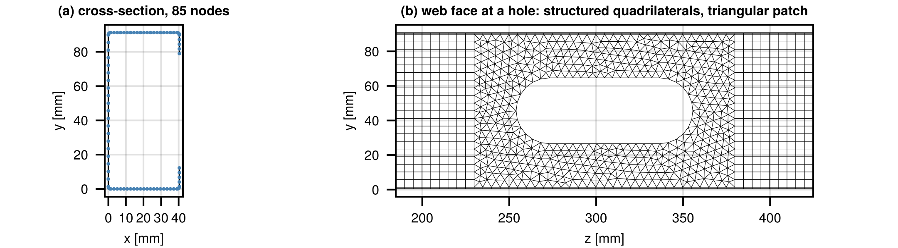
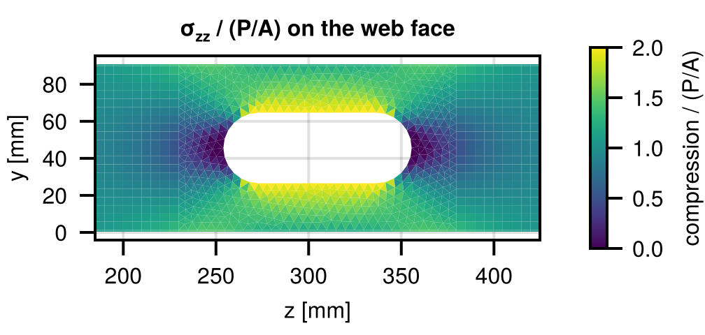
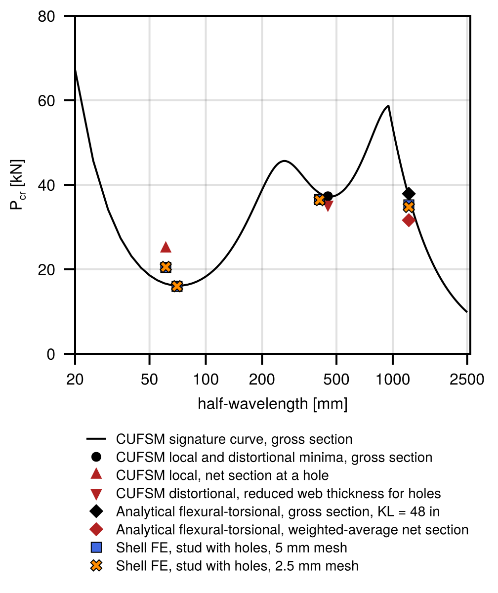
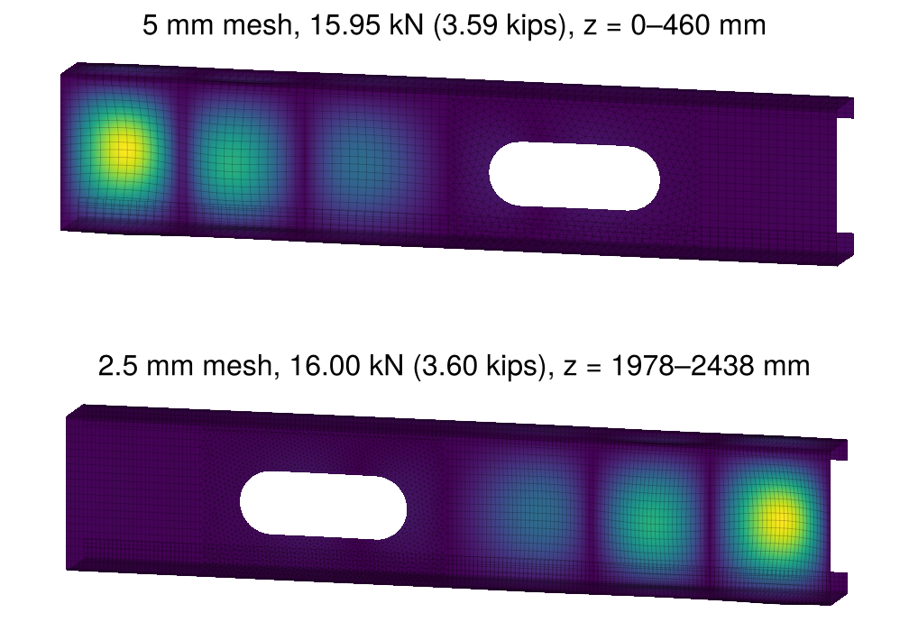
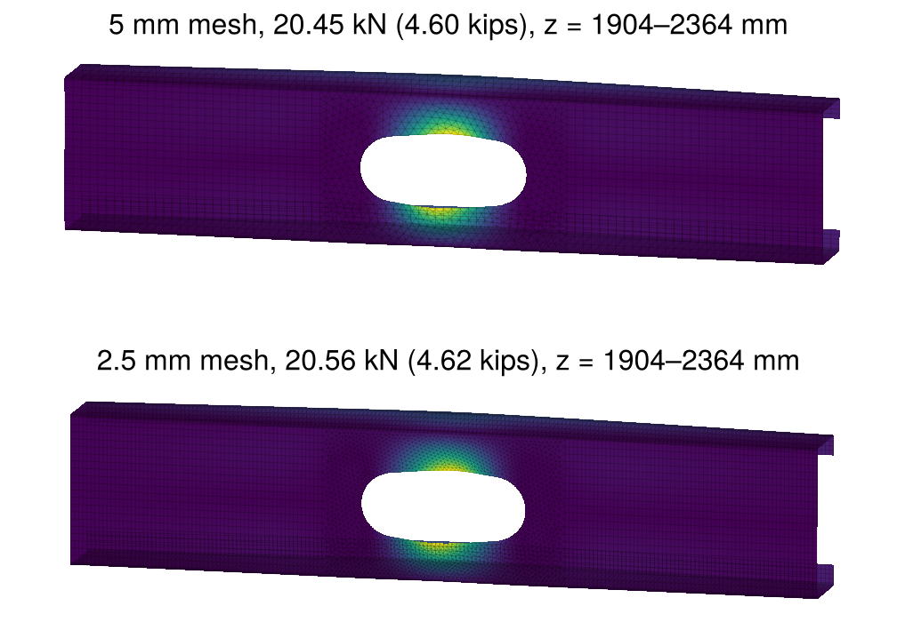
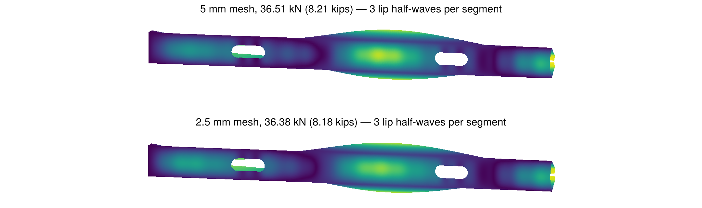
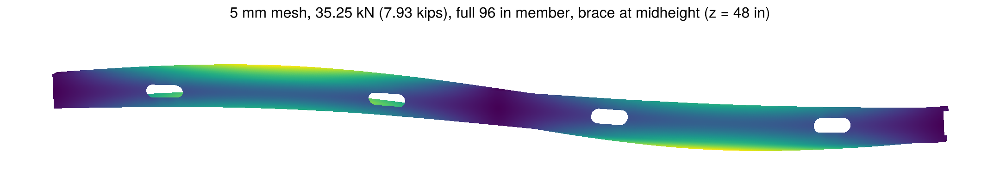

@layout title
# Elastic buckling analysis of a cold-formed steel stud column with open-source shell finite element software
@kicker Cristopher D. Moen and Amoke Shabhari · RunToSolve LLC
@chips Wei-Wen Yu International Specialty Conference on Cold-Formed Steel Structures | Madison, Wisconsin | October 6–7, 2026
@keys runtosolve.github.io/ICCFSS2026_MoenShabhariStudElasticBuckling · cris.moen@runtosolve.com
@fig svg data/qr.svg

---

@eyebrow Motivation
# Shell finite element analysis, in the open

- Few modern shell implementations are available for public inspection, and what commercial codes do under the hood is hard to know
- A multi-year effort built a trusted, open-source shell capability in **Julia**, connected to the general-purpose finite element framework **Ferrite.jl**
- Two Mindlin shell elements are now published as packages with elastic and geometric stiffness matrices
  - **TriShellFiniteElement.jl**, a 3-node triangle
  - **QuadShellFiniteElement.jl**, a "4+2" quadrilateral
- This talk walks through one eigenbuckling analysis of a common wall stud with holes
@gap 12
?> Thanks to Sándor Ádány for the shell element formulations and MATLAB reference implementations

---

@eyebrow Open-source shell elements
# Two flat Mindlin shells, six dofs per node

::: cols
::: panel Triangle (TriShellFiniteElement.jl)
- Constant-strain membrane; Mindlin bending with the Tessler–Hughes shear treatment (mid-side deflections condensed out)
- Shear relaxation $1/(1 + C_s\alpha)$, $C_s = 0.2$, calibrated so a simply supported plate converges to $k = 4.0$
- Hughes–Brezzi drilling stiffness, so folded plates assemble without singular matrices
:::
:: col
::: panel Quadrilateral (QuadShellFiniteElement.jl)
- The "4+2" element of Moen and Ádány: bilinear shape functions plus two bubble functions, condensed at the element level, which relieves in-plane bending stiffness and part of the shear locking
- Same shear relaxation ($C_s = 0.1$) and drilling term
- Julia matrices reproduce the MATLAB reference to machine precision (a package test)
:::
:::
@gap 16
- Geometric stiffness from the Green–Lagrange membrane strains ($N_x, N_y, N_{xy}$ and the gradients of all three translations); $\mathbf{K}\boldsymbol{\phi} = \lambda(-\mathbf{K}_g)\boldsymbol{\phi}$, and with a unit reference load the eigenvalue is the buckling load

---

@eyebrow Stud column example
# A 362S162-33 wall stud with SFIA service holes
@chips 362S162-33 | L = 96 in | braced at midheight | pinned, warping-free ends | 1.5 × 4 in holes at 24 in o.c.
@gap 10

::: cols
- Web 3.625 in, flange 1.625 in, lip 0.5 in, design thickness **0.0346 in**; $E$ = 29 500 ksi, $\nu$ = 0.3
- Brace at midheight: $L_x = L_y = L_t$ = 48 in; uniform compression at both ends, $P_\mathrm{ref}$ = 1 N
- Four stadium-shaped holes at 12, 36, 60, and 84 in; the brace point is 12 in from the nearest holes
:: col
- Centerline polyline from CrossSectionGeometry.jl: 85 nodes, corner radius $2t$, 4 elements per lip, 20 per flange and web, 4 per corner arc
- The same polyline goes to CUFSM.jl, so the shell and finite strip analyses share their geometry
:::

?> (a) 85-node centerline polyline; (b) web mesh around a hole: structured quadrilaterals outside the 150 mm patch, triangles inside it

---

@eyebrow Stud column example
# Degrees of freedom, boundary conditions, brace

::: cols
```julia title="Two element types, one DofHandler" sub="patch-boundary nodes share dofs" size="14"
dh = DofHandler(grid)
sq = SubDofHandler(dh, quad_cells)
ipq = Lagrange{RefQuadrilateral, 1}()
add!(sq, :u, ipq^3); add!(sq, :θ, ipq^3)
st = SubDofHandler(dh, tri_cells)
ipt = Lagrange{RefTriangle, 1}()
add!(st, :u, ipt^3); add!(st, :θ, ipt^3)
close!(dh)
```
@gap 12
```julia title="Pinned warping-free ends and the midheight brace" size="13"
ch = ConstraintHandler(dh)
add!(ch, Dirichlet(:u, end_nodes,              # ux = uy = 0
         (x, t) -> [0.0, 0.0], [1, 2]))
add!(ch, Dirichlet(:u, brace_corner_nodes,     # ux = 0
         (x, t) -> [0.0], [1]))  #!hl
add!(ch, Dirichlet(:u, Set([brace_web_center]), # uy = uz = 0
         (x, t) -> [0.0, 0.0], [2, 3]))
close!(ch)
```
:: col
- Ends: $u_x = u_y = 0$ at every end node, $u_z$ and all rotations free
- Load: equal and opposite axial nodal forces by tributary centerline length, giving uniform $P/A$ away from ends and holes
- Brace: $u_x = 0$ at the two **web-flange corners** (translation perpendicular to the web and twist), $u_y = 0$ and the axial datum $u_z = 0$ at the web mid-depth node on the symmetry axis, so no prebuckling stress is induced
:::

---

@eyebrow Stud column example
# Pre-buckling stresses and geometric stiffness

::: cols
```julia title="One call per package, summed" size="13"
Kq = QuadShellFiniteElement.assemble_global_Ke!(
         allocate_matrix(dh, ch), sq, qr2, qr3,
         IP4(), IP6(), E, ν, t; Cs = 0.1)
Kt = TriShellFiniteElement.assemble_global_Ke!(
         allocate_matrix(dh, ch), st, qr1, qr3,
         IP3(), IP6(), E, ν, t; Cs = 0.2)
K = Kq + Kt;  apply!(K, F, ch)
u = K \ F;  apply!(u, ch)
σ = membrane_stresses(dh, u, E, ν, t)  # element frame
Kg = assemble_Kg(dh, ch, σ, t)         # summed, too
```
@gap 14
- Static problem solved with Julia's sparse direct solver; membrane stresses recovered element by element (one per triangle, four Gauss points per quadrilateral)
- Normalized by $P/A$: **1.0** in the bulk, about **1.9** in the web strips beside a hole, **1.25** in the flanges at the hole plane, **0.5** just above and below the hole
:: col

?> Pre-buckling longitudinal membrane stress on the web face around a hole, normalized by $P/A$
:::

---

@eyebrow Stud column example
# Solving the eigenvalue problem with ARPACK

::: cols
```julia title="Lowest modes: K⁻¹(−Kg), one Cholesky factorization" size="14"
Kfac = cholesky(Symmetric(K));  tmp = zeros(n)
op!(y, x) = (mul!(tmp, Kg, x); y .= Kfac \ -tmp)
μ, Φ = eigs(LinearMap(op!, n; ismutating = true);
            nev = 12, which = :LM)
Pcr = 1 ./ real.(μ)      # N, because P_ref = 1 N
```
@gap 14
```julia title="Shift-and-invert: modes nearest a target load σ" size="14"
Mfac = ldlt(Symmetric(K + σ * Kg))      # indefinite
op!(y, x) = (mul!(tmp, Kg, x); y .= Mfac \ -tmp)
ν, V = eigs(LinearMap(op!, n; ismutating = true);
            nev = 40, which = :LM)
Pcr = σ .+ 1 ./ real.(ν)
```
:: col
- Implicitly restarted Arnoldi on $\mathbf{K}^{-1}(-\mathbf{K}_g)$: its largest eigenvalues are the reciprocals of the smallest buckling loads
- A perforated member has **hundreds of local modes** below its distortional and global loads, so the bottom of the spectrum never reaches them
- Shift-and-invert with targets from 14 to 60 kN, 40 modes per target, one indefinite factorization and about 20 s each
- Every mode is **classified automatically**: displacement ratio at the hole patches (local at a hole), rigid-body energy fraction (global: weak-axis, strong-axis, torsion), flange-lip versus web-flange corner motion (distortional), else local
:::

---

@eyebrow Results
# Finite strip and closed-form reference values

::: cols

:: col
- **CUFSM.jl, gross section:** local minimum 16.14 kN at 70 mm, distortional 37.20 kN at 460 mm
- **Hole approximations** (CeeSectionBuckling.jl, the RunToSolve SFIA evaluation procedure)
  - net section through the hole: local 24.88 kN, above the gross value, so the unperforated web governs
  - AISI S100 reduced web thickness $t_r = t(1 - L_h/L_{crd})^{1/3}$ = 0.807 mm: distortional 37.30 → 35.35 kN
- **Closed form, $KL$ = 48 in:** $P_{ex}$ = 314.6, $P_{ey}$ = 56.9, $P_t$ = 40.0, flexural-torsional **37.89 kN**; weighted-average net properties 31.63 kN
- **Finite strip at one 1219 mm half-wave** (section free to distort): 37.17 kN flexural-torsional, 49.58 kN weak-axis flexure
:::

---

@eyebrow Results
# Shell finite element buckling loads, kN

| Buckling mode | 5 mm mesh | 2.5 mm mesh | 5 mm, no holes | Finite strip / analytical |
| --- | --- | --- | --- | --- |
| Local, lowest | 15.95 | 16.00 | 15.79 | 16.14 (CUFSM gross) |
| Local at the holes (web strips) | 20.45 | 20.56 | – | 24.88 (net section) |
| Distortional, 3 half-waves per segment | 36.51 | 36.38 | 37.37 | 35.35 (reduced t), 37.30 (gross) |
| Distortional–hole interaction, 5 half-waves | 32.63 | 32.33 | – | – |
| Global, flexural-torsional | ==35.25== | 34.76 | 37.15 | 37.89 (closed form), 37.17 (CUFSM) |
| Global, weak-axis flexure | 46.74 | 47.70 | 49.58 | 56.93 (Euler), 49.58 (CUFSM mode 2) |
?> Halving the element length changes every load by less than two percent. The lowest mode is local; the governing global mode is flexural-torsional.

---

@eyebrow Results
# Local modes

::: cols

?> Lowest local mode, 15.95 kN: the web buckles between the holes
:: col

?> Lowest mode at a hole, 20.45 kN: the two web strips bow in opposite directions
:::
@keys 5 mm mesh (top) and 2.5 mm mesh (bottom) in each figure; color is displacement magnitude

---

@eyebrow Results
# Distortional and global modes


?> Lowest distortional mode, 36.51 kN, lower 48 in braced segment: three half-waves per braced segment, the brace plane is a node

?> Lowest global mode, 35.25 kN, full 96 in member: lateral translation plus twist, one half-wave in each braced segment, the brace at midheight is a node

---

@eyebrow Computational performance
# Six minutes on a laptop for a quarter-million dofs

::: cols
| Step | 5 mm mesh | 2.5 mm mesh |
| --- | --- | --- |
| Degrees of freedom | 247 998 | 509 286 |
| Assemble elastic stiffness | 6 s | 9 s |
| Static solve | 3 s | 6 s |
| Assemble geometric stiffness | 2 s | 3 s |
| Cholesky factorization of K | 10 s | 20 s |
| 12 lowest modes (ARPACK) | 9 s | 18 s |
| 13 shift-and-invert windows, 40 modes each | 356 s | 903 s |
:: col
- Apple M3 Max laptop, sparse factorizations on 7 threads, less than 2 GB of memory
- Each shift-and-invert window is one indefinite factorization and about 27 s; the sweep yields about 190 distinct modes between 16 and 65 kN
- Julia compiles the packages on first use, roughly a minute per session
:::

---

@eyebrow Open-source shell elements
# Documentation and validation live on GitHub

- Each repository README documents the element mechanics, the calling sequence with Ferrite.jl, and the default parameters; docstrings cover the public functions
- The **test suites are the validation record**. For the triangle:
  - element symmetry, rigid body modes, thickness independence
  - uniform compression reproducing $PL/EA$
  - simply supported plate converging to $k = 4.0$, clamped plate to $k \approx 10.07$
  - buckling load invariant to the orientation of the plate in space
  - torsion of flat and folded strips and of a rounded lipped channel reproducing the thin-walled torsion constant within a few percent
- For the quadrilateral: element-by-element comparison with the MATLAB reference, plus the plate bending, membrane, and column buckling benchmarks of the earlier paper
- `Pkg.test()` on either package regenerates every number in this list

---
@layout title
# Elastic buckling analysis of a cold-formed steel stud column with open-source shell finite element software
@kicker Cristopher D. Moen and Amoke Shabhari · RunToSolve LLC
@chips Wei-Wen Yu International Specialty Conference on Cold-Formed Steel Structures | Madison, Wisconsin | October 6–7, 2026
@keys runtosolve.github.io/ICCFSS2026_MoenShabhariStudElasticBuckling · cris.moen@runtosolve.com
@fig svg data/qr.svg
